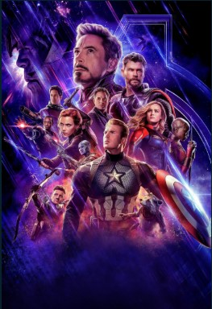
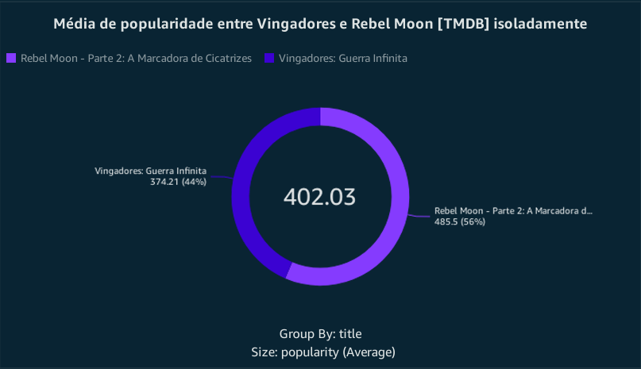

## Informações do desafio:
O Desafio de Filmes e Séries está dividido em 5 entregas. Nesta etapa será realizada a entrega 5, a entrega final. Os detalhes do Desafio completo estão na Sprint 6:   

``
Consumindo dados da camada Refined utilizando o amazon Quicksight.
``

## Perguntas para o desafio final
### Obs: Mais uma vez tive de trocar as perguntas, pois as outras estavam muito genéricas e não dariam uma boa analise.

``"1.Por que a métrica de popularidade do TMDB não é uma boa referência para avaliar filmes populares?"``   

``"2.A fusão de Ação, Aventura e Ficção são uma possível receita para o sucesso?"``  

 
### Desafio
- [Desafio](../Desafio/Etapas/)  

Faremos uso do Amazon Quicksight, consumindo dados existentes na camada Refined e catalogados no AWS Athena e por fim gerando análises sobre esses dados.
## Cores
As cores do dashboard foram inspiradas no pôster de `Vingadores:Ultimato`.

## Base de dados


# Gráficos 
## - gráfico 1

## - gráfico 2

## - gráfico 3

Storytelling: ```"As décadas de 1960, 1970, 1990, 2010 e 2020 marcaram momentos cruciais na história do cinema, em que os gêneros de ação, aventura e Ficção 
científica começaram a dominar a indústria cinematográfica. 
Essas eras foram definidas por inovações tecnológicas, narrativas ousadas e a popularização de franquias icônicas que influenciaram profundamente a cultura pop e redefiniram o que o público esperava das produções cinematográficas.
"```
## - gráfico 4


## Vizualizar dashboard
Pode fazer o download do dashboard clicanco aqui: [Download](https://drive.google.com/file/d/1JZtvpuVs4ZD4Cc4dRQy1tYpbVGJse147/view?usp=sharing)

