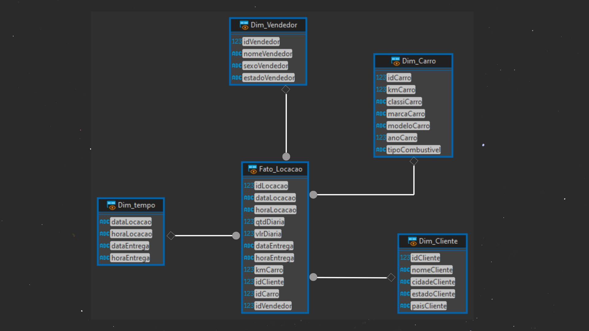

# Resumo do desafio

### 1NF:

    Não existe necessidade de passar para a primeira forma, pois, as tabelas já estão na 1NF,  não há grupos repetitivos e cada coluna contém um valor atômico.

### 2NF:
#### Na 2NF já é necessário fazer algumas modificações na base de dados:
```bash
A tabela Locacao possui dependências parciais, pois suas colunas não chave (idCliente, idCarro, idVendedor) dependem da chave composta (idLocacao). 
```
Para resolver isso, é necessário criar tabelas adicionais para separar essas entidades:
```bash
    Tabela 'Locacao' (idLocacao, idCliente, idCarro, idVendedor)

    Tabela 'Cliente' (idCliente, nomeCliente, cidadeCliente, estadoCliente, paisCliente)

    Tabela 'Carro' (idCarro, kmCarro, classiCarro, marcaCarro, modeloCarro, anoCarro, idCombustivel)

    Tabela 'Vendedor' (idVendedor, nomeVendedor, sexoVendedor, estadoVendedor)
```

### 3NF:
####

A tabela Carro possui uma dependência transitiva, pois o tipoCombustivel depende do idCombustivel.  
Para resolver isso, é necessário criar uma tabela adicional para separar o combustível:

```bash
Tabela 'Combustivel' (idCombustivel, tipoCombustivel)

Tabela 'Carro' (idCarro, kmCarro, classiCarro, marcaCarro, modeloCarro, anoCarro, idCombustivel)

Após essas etapas, o banco de dados estará normalizado até a 3NF, com as seguintes tabelas:

    Cliente  
    Carro  
    Combustivel  
    Vendedor  
    Locacao  
    Locacao_info  
    tb_locacao # ---> Tabela antes da normalização

```
 Essa estrutura garante a eliminação de redundâncias e a integridade dos dados, além de facilitar a manutenção e a consulta das informações.  

### Depois de tudo isso é necessário fazer o desenho do DER (diagrama entidade relacionamento). Utilizei o Dbeaver, mas a escolha é pessoal.


##  Diagrama Dimensional
Nesse modelo, tenho uma tabela de fatos central, rodeada por tabelas de dimensões. Irei detalhar cada um dos elementos:

### Tabela de Fatos: Fato_Locacao   
#### métricas e informações presentes nesta tabela:  
```bash
idLocacao: "Identificador único da locação" 
dataLocacao: "Data da locação"
horaLocacao: "Hora da locação"  
qtdDiaria: "Quantidade de diárias"  
vlrDiaria: "Valor da diária"  
dataEntrega: "Data da entrega"  
horaEntrega: "Hora da entrega"  
kmCarro: "Quilometragem do carro"  
idCliente: "Identificador do cliente"  
idCarro: "Identificador do carro"  
idVendedor: "Identificador do vendedor"  
```
### Tabelas de Dimensão  

As tabelas de dimensão fornecem os detalhes contextuais para as métricas presentes na tabela de fatos. Elas permitem uma análise multidimensional dos dados.

Dim_Cliente:

    Contém informações detalhadas sobre os clientes, como nome, cidade, estado e país.
Dim_Carro:

    Contém informações detalhadas sobre os carros, como quilometragem, classificação, marca, modelo, ano e tipo de combustível.
Dim_Vendedor:

    Contém informações detalhadas sobre os vendedores, como nome, sexo e estado.
Dim_Tempo:

    Contém informações sobre as datas e horas de locação e entrega.




# Etapas


1. ...
[Etapa I](etapa-1/NORMALIZACAO.sql)


2. ...
[Etapa II](etapa-2/DIMENSIONAMENTO.sql)