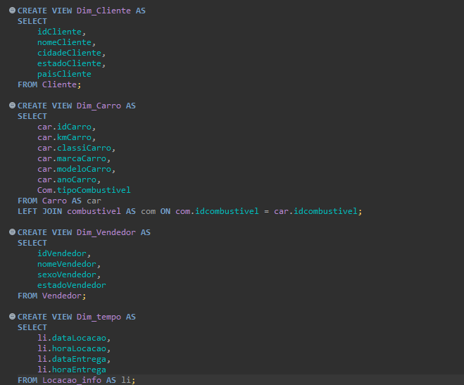
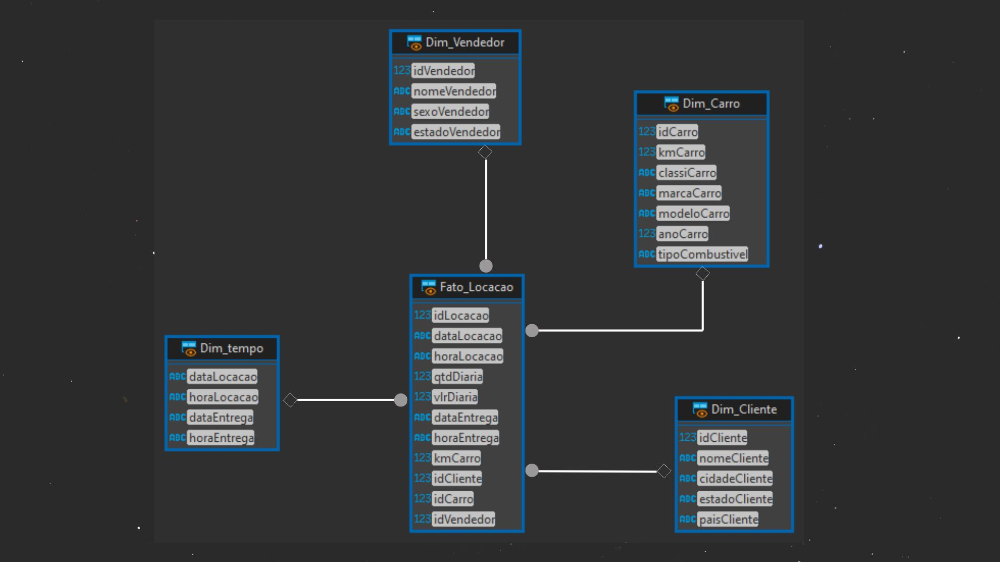
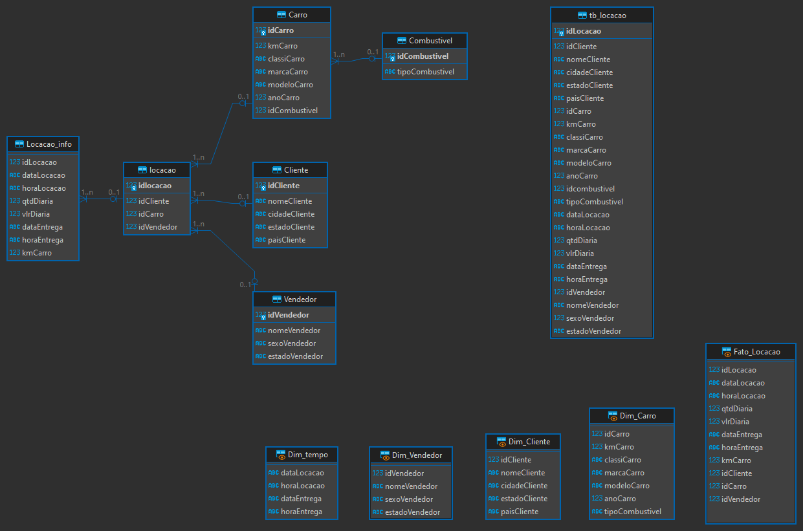
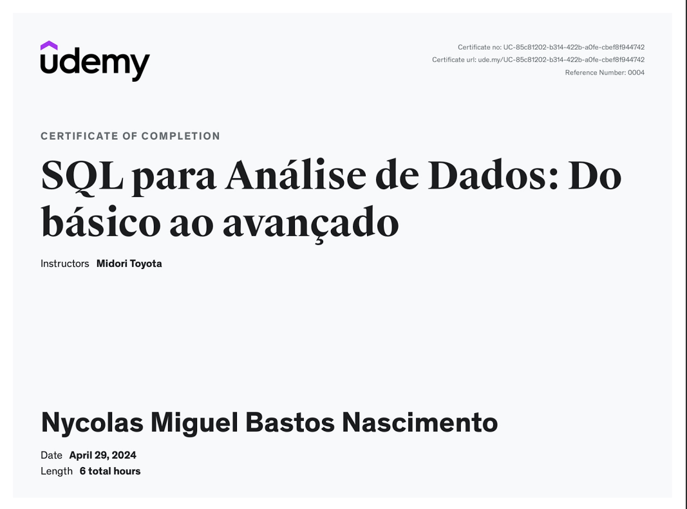

# Desafio
## --[ Ir para Desafio](./Desafio/README.md) --

# Aprendizados
### Nessa sprint aprendi a normalizar uma base de dados até a terceira forma normal (3NF), no começo parecia não estar entendo muito bem mas no final deu tudo certo, aprendi também alguns conceitos interessantes sobre AWS.

# Evidências
## --[ Ir para Evidências](./evidencias/) --

### Normalização
  

### Inserção dos dados na nova base de dados normalizada

### Criando a tabela fato

### Criando as dimensões

### Diagrama relacional

### Diagrama Dimensional

### Tabelas Criadas

# Exercícios
## --[ Ir para Exercícios](./exercicios/) --
### --[ Exercício 01 ](./exercicios/Section%2003/Exercicios%20section%2003.sql) --
### --[ Exercício 02 ](./exercicios/Section%2004/Script-6.sql) --
### --[ Exercício 03 ](./exercicios/Section%2006/) --

# Certificados
- Certificado SQL
 

- Certificado AWS
