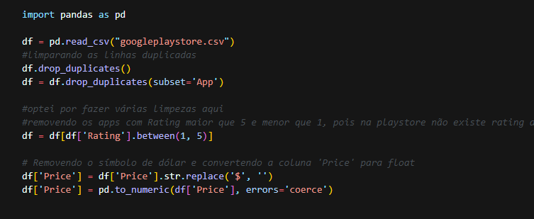
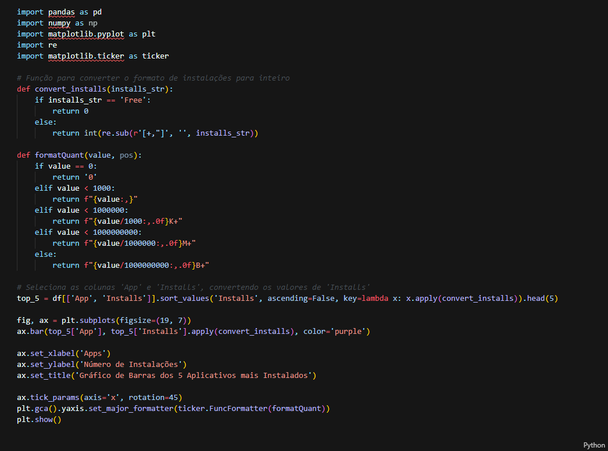
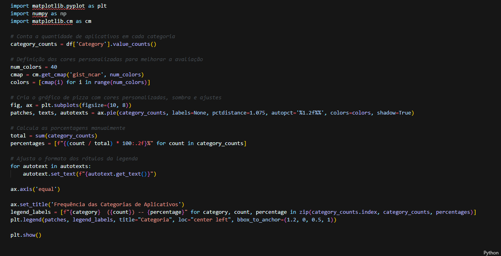
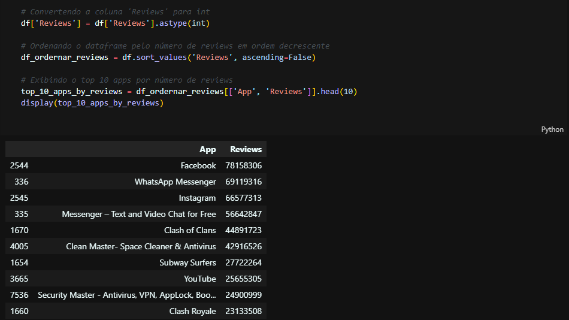
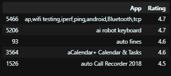
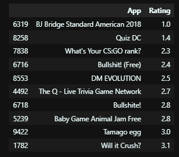

# __#Etapas__
## Informações do desafio:
O objetivo é ler o arquivo de estatísticas da Loja do Google (googleplaystore.csv) processar e gerar gráficos de análise. Para isso será necessário seguir as seguintes etapas.  

## Etapa 1
### Na primeira etapa precisamos instalar as bibliotecas Pandas e Matplotlib, para isso basta abrir o seu terminal e digitar o seguinte.
#### Terminal
```python
    pip install pandas  
    pip install matplotlib
```
### Para confirmar a instalação vamos digitar ainda no terminal
#### Terminal
```python
    pip list #ou pip freeze
    # Isso retornará todas as bibliotecas instaladas e suas respectivas versões
```   


## Etapa 2
### 1 - Vamos ler o arquivo googleplaystore.csv e fazer a limpeza dos dados



### 2 - Agora vamos fazer um gráfico de barras contendo os top 5 apps por número de instalação.



### Resultado:


### 3 -  A próxima etapa é criar um gráfico de pizza (pie chart) mostrando as categorias de apps existentes no dataset de acordo com a frequência que elas aparecem.


### Resultado:


### 4 - Agora precisamos mostrar qual o app mais caro existente no dataset.


### 5 - Vamos mostrar quantos apps são classificados como 'Mature 17+'.


#### Para uma melhor vizualição do resultado:
```python
    Resultado: total de Apps: 357 Apps com a Classificação Mature 17+
```

### 6 - Agora vamos mostrar o top 10 apps por número de reviews bem como o respectivo número de reviews. Vamos ordernar a lista de forma decrescente por número de reviews.



### 7 - Precisamos criar pelo menos mais 2 cálculos sobre o dataset e apresentar um em formato de lista e outro em formato de valor. Por exemplo: "top 10 apps por número de reviews" e "o app mais caro existente no dataset."
#### 7.1 - Primeiro cálculo: Script para cálcular os 5 apps mais bem avaliados que começam com a letra A
```python
df_ordernar_Apps = df[df['App'].str.startswith('a', na=False)].sort_values('Rating', ascending=False)
top_5_apps_rating = df_ordernar_Apps[['App', 'Rating']].head(5)
display(top_5_apps_rating)
```
### Resultado:


#### 7.2 - Segundo cálculo: Script para cálcular os 10 apps mais mal avaliados da categoria GAME
```python
df_ordernar_Categorias = df[df['Category'].str.startswith('GAME', na=False)].sort_values('Rating',  ascending=True)
top_10_apps_rating = df_ordernar_Categorias[['App', 'Rating']].head(10)
display(top_10_apps_rating) 
```
### Resultado:




### 8 - Para finalizar vamor criar pelo menos outras 2 formas gráficas de exibição dos indicadores acima utilizando a biblioteca matplotlib. Os gráficos tem que ser diferentes do que já fizemos.

### Gráfico de histograma para analisar a distribuição de avaliações dos aplicativos 


### Gráfico de Linha para mostrar qual categoria tem mais avaliações
