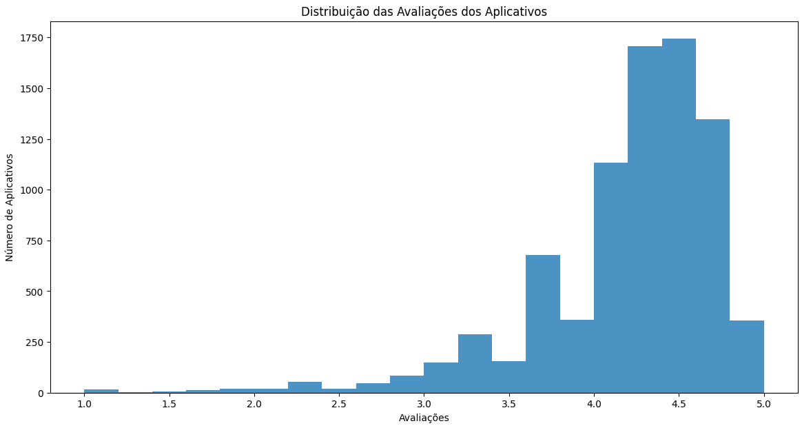

# Desafio
## --[ Ir para Desafio](./Desafio/) --

# Aprendizados
### Nessa sprint aprendi a sobre a linguagem python e toda a sua estrutura, já tinha noção de OO(Orientação Objetos), mas quando vi em python percebi que toma um rumo um pouco diferente mas não tão distante, aprendi um pouco mais sobre aspectos econômicos da nuvem da AWS.

# Evidências
## --[ Ir para Evidências](./evidencias/) --

### Configurando o ambiente
  

### Gráficos criados

### Bibliotecas instaladas

# Exercícios
## --[ Ir para Exercícios](./exercicios/) --
### --[ Exercício 01 ](./exercicios/Section%2003/) --
### --[ Exercício 02 ](./exercicios/Section%2004/) --
### --[ Exercício 03 ](./exercicios/Section%2005/) --

# Certificados

- Certificado AWS
