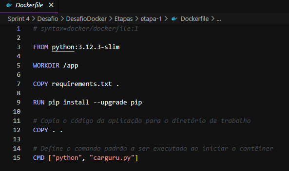
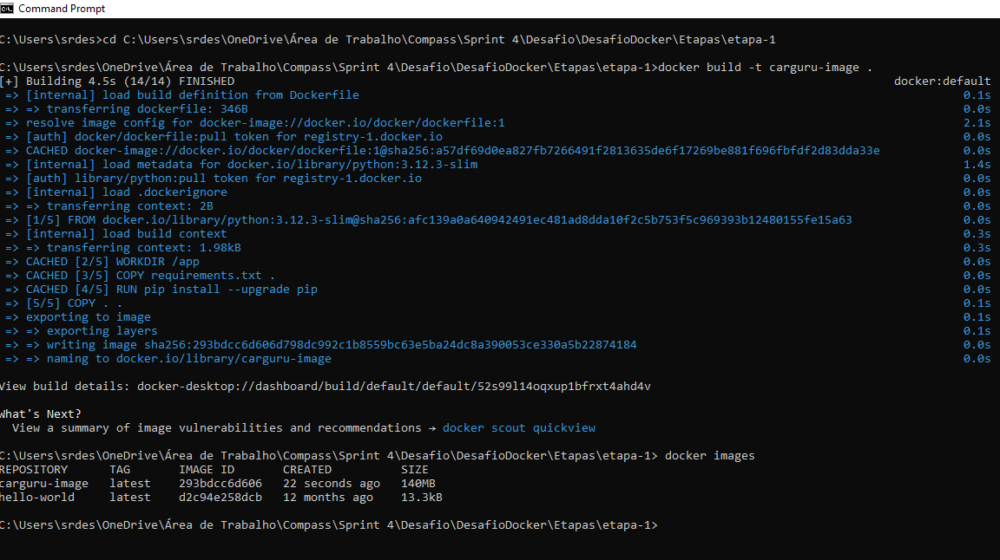
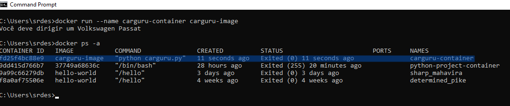

### Etapa 1 - Construa uma imagem a partir de um arquivo de instruções Dockerfile que execute o código carguru.py. Após, execute um container a partir da imagem criada.
Os artefatos para contrução desssa primeira etapa estão localizados nesse diretório:

### Como Construir a Imagem Docker

Primeiro crie o arquivo Dockerfile e digite os seguintes comandos nele:  

  

Agora vamos construir a imagem pelo terminal:



1. **Navegue até o diretório `etapa-1`**:

   ```bash
   cd C:\Users\srdes\OneDrive\Área de Trabalho\Compass\Sprint4\Desafio\DesafioDocker\Etapas\etapa-1
2. **Construa a imagem**:   
    ```bash
    docker build -t carguru-image .
3. **Confirme se a imagem foi criada**:   
    ```bash
    docker images
### Como executar um container a partir de uma Imagem Docker



1. **Execute um container a partir da imagem criada:** 
   ```bash
    docker run --name carguru-container carguru-image