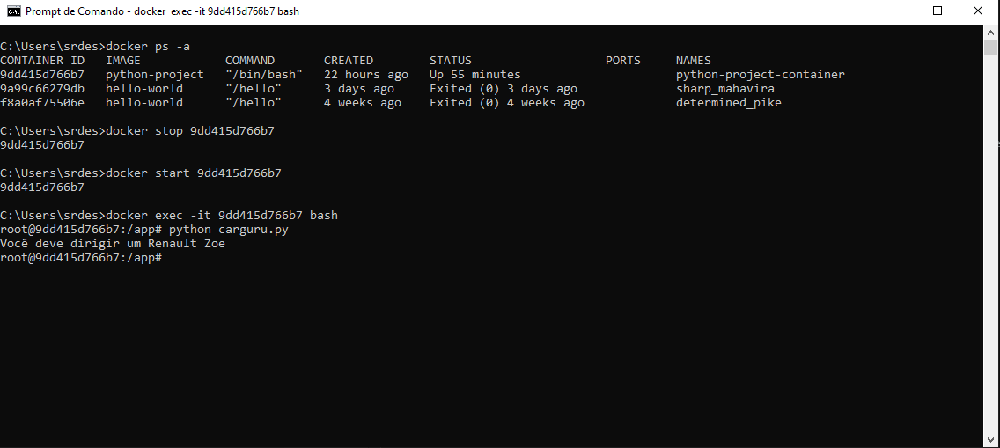

### Etapa 2 - É possível reutilizar containers? Em caso positivo, apresente o comando necessário para reiniciar um dos containers parados em seu ambiente Docker? Não sendo possível reutilizar, justifique sua resposta.

 A resposta para essa questão com toda certeza é sim, para comprovar vou lhe mostrar como entendi isso.  

 Na etapa 1 foi pedido que eu construísse uma imagem a partir de um arquivo de instruções (Dockerfile) que execute o código (carguru.py). Após,
executar um container a partir da imagem criada.

Após executar o conteiner a partir da imagem que eu criei, queria usar novamente o mesmo container para testar novamente. 

### Primeiro vamos listar os containers criados para pegar o id do container que deseja reutilizar:
    docker ps -a
### Agora pode reinicar esse container:
    docker start <id> -> aqui vai o id do container
Entretanto, esse comando apenas reinicia o container, podemos utilizar outro comando para realmente reutilizar esse container:
    
    docker exec -it <id> bash 

