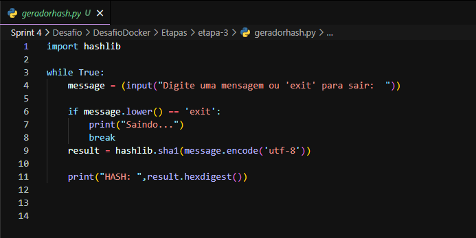
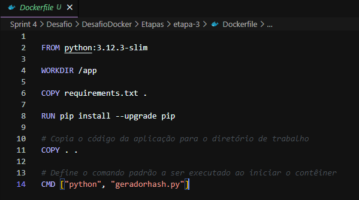
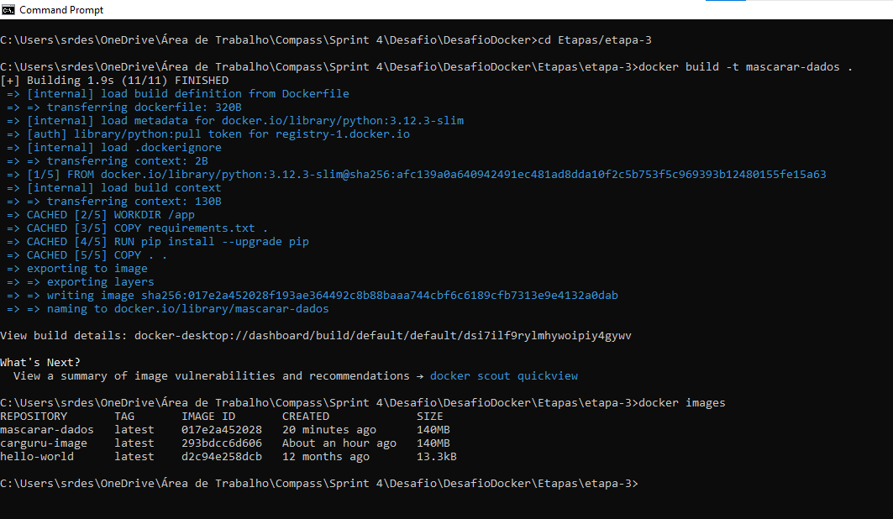
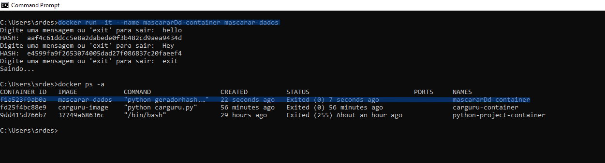

### Agora vamos exercitar a criação de um container que permita receber inputs durante sua execução. 

Primeiro crie um script que permita receber inputs:  


No mesmo diretório que criou o script de cima crie o arquivo Dockerfile e digite os seguintes comandos nele:  


### Construindo e executando a imagem docker:



1. **Navegue até o diretório `etapa-3`**:

   ```bash
   cd C:\Users\srdes\OneDrive\Área de Trabalho\Compass\Sprint4\Desafio\DesafioDocker\Etapas\etapa-3

2. **Construa a imagem**:   
    ```bash
    docker build -t mascarar-dados .

3. **Confirme se a imagem foi criada**:   
    ```bash
    docker images
  


1. **Para executar um container a partir de uma imagem utilizaremos o comando:**:
   ```bash
   docker run -it --name mascararDd-container mascarar-dados
Note que utilizei a flag `-it` nesse comando mas não usei na etapa 1, a resposta é que para executar um script Python interativo (que tem inputs) em um container Docker, você precisa garantir que o terminal esteja configurado para interatividade. Uma maneira de fazer isso é usar a opção `-it` ao executar o container, o que conecta o terminal do host ao do container.

2. **Verificar se o container foi criado**:   
    ```bash
    docker ps -a
