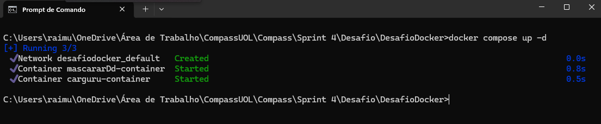

# __#Organização desse desafio__
- **DesafioDocker/**: Diretório raiz do projeto.
  - **Etapas/**: Diretório contendo as diferentes etapas do projeto.
    - **etapa-1/**: Diretório específico para a primeira etapa.
      - **carguru.py**: Script Python que será executado.
      - **Dockerfile**: Arquivo de instruções para construir a imagem Docker.
      - **requirements.txt**: Lista de dependências Python necessárias para o `carguru.py`.
      - **Etapa1.md**: arquivo para leitura dessa etapa.
    - **etapa-2/**: Diretório específico para a segunda etapa.
      - **resposta.md**: arquivo para leitura e resposta dessa etapa.
    - **etapa-3/**: Diretório específico para a terceira etapa.
      - **geradorhash.py**: Script Python que será executado.
      - **Dockerfile**: Arquivo de instruções para construir a imagem Docker.
      - **requirements.txt**: Lista de dependências Python necessárias para o `geradorhash.py`.
      - **Etapa3.md**: arquivo para leitura dessa etapa.
  - **docker-compose.yml**: Arquivo para orquestração de múltiplos containers Docker (se necessário).
  - **venv/**: Diretório contendo o ambiente virtual Python.
    - **Lib/**: Bibliotecas Python instaladas no ambiente virtual.
    - **Scripts/**: Scripts executáveis no ambiente virtual.
    - **pyvenv.cfg**: Configuração do ambiente virtual Python.
  - **README.md**: Arquivo de documentação do projeto.


## Informações do desafio:
O objetivo é a prática de Python com Containers Docker combinando conhecimentos adquiridos no PB. O desafio foi separado em apenas 3 etapas, as quais estão localizadas logo abaixo:


### Etapa 1
- [Etapa1](../Desafio/DesafioDocker/Etapas/etapa-1/)  
### Etapa 2
- [Etapa2](../Desafio/DesafioDocker/Etapas/etapa-2/)
### Etapa 3
- [Etapa3](../Desafio/DesafioDocker/Etapas/etapa-3/)

## DockerCompose
Decidi ir um pouco além do desafio e criei um arquivo `docker-compose.yaml` para orquestrar os containers e imagens que foram pedidos para serem criados no desafio, lembrando que é apenas uma alternativa mais fácil para executa-los, mantive o padrão de entrega nas etapas anteriores.

### [Acesse o arquivo aqui](../Desafio/DesafioDocker/docker-compose.yaml)

## Passos para executar o docker-compose

1. **Abra um novo terminal e navegue até o diretório onde está localizado o arquivo `docker-compose.yaml`, no meu caso está em `DesafioDocker/`**:  

   ```bash
   cd C:\Users\srdes\OneDrive\Área de Trabalho\Compass\Sprint4\Desafio\DesafioDocker
2. **Criar os containers com o arquivo**:   
    ```bash
    docker-compose up 
  
Podemos observar que apenas o output do script da `etapa 1` apareceu, apesar dos dois containers serem executados, vamos entender isso:

 **Digitando**:
    
    docker-compose ps -a 

  
Deu para perceber que ambos foram executados, o `carguru-container` foi o container da etapa 1 e foi executado com sucesso, como o `mascararDd-container` tem dentro dele o script `geradorhash.py` que tem um input nele, precimos entrar dentro desse container para que ele possa concluir sua execução completa, faremos isso dessa forma abaixo:

  

Usei esse comando para localizar o container que desejo entrar.
1. **Pegar Id do container**:  
   ```bash
   docker ps -a
2. **Executando o container**:   
    ```bash
    docker exec -it <id> bash
  

Dessa forma pude entrar dentro do container e executar o script que estava lá dentro.

## Podemos parar e remover os containers agora.
    
 
Com o comando:
    
    docker-compose down
Conseguimos remover todos os containers e imagens que foram gerados pelo nosso arquivo `docker-compose.yaml`.