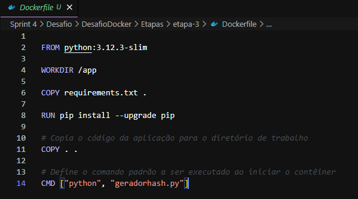
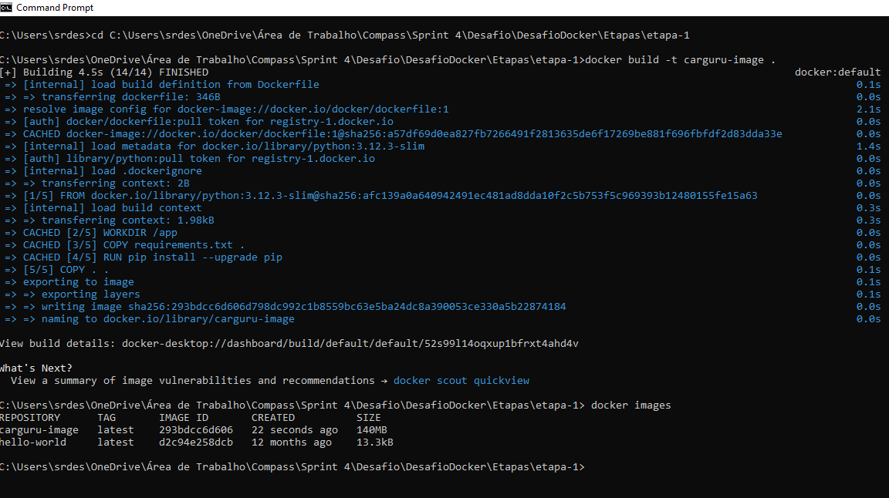
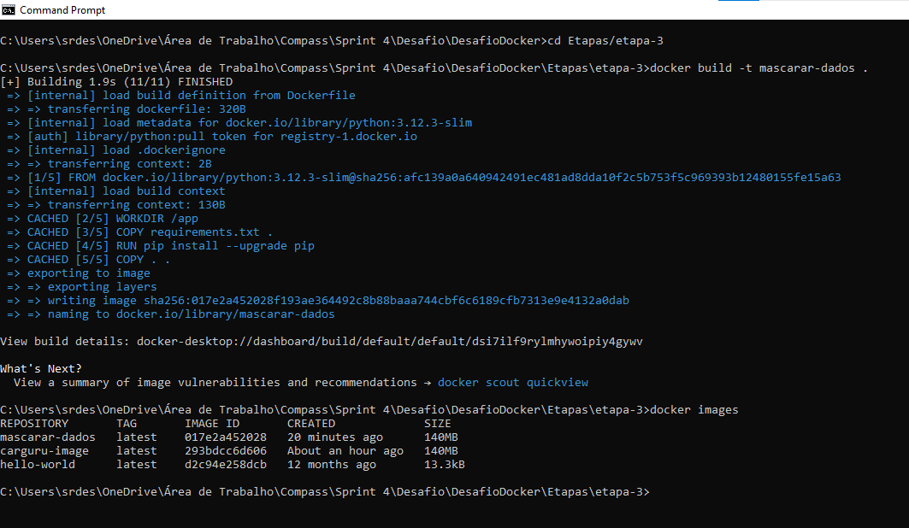
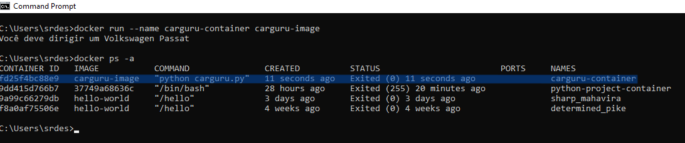
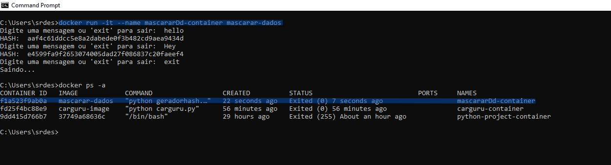

# Desafio
## --[ Ir para Desafio](./Desafio/) --

# Aprendizados
### Nessa sprint aprendi sobre docker e o processo de conteinerização com docker, aprendi algumas noções de programação funcional, espero que eu tenha mais tempo para me aprofundar ainda mais nesses conhecimentos aprendidos, tanto nessa quanto nas outras sprints.

# Evidências
## --[ Ir para Evidências](./evidencias/) --

### Configurando o ambiente
#### Etapa 1
 

#### Etapa 2
 

### Comandos terminal

 
 
 
 
 
# Exercícios
## --[ Ir para Exercícios](./exercicios/) --

# Certificados

- Certificado AWS credenciamento

- Certificado AWS Technical

