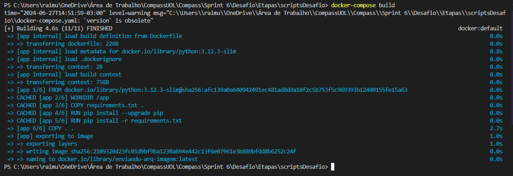
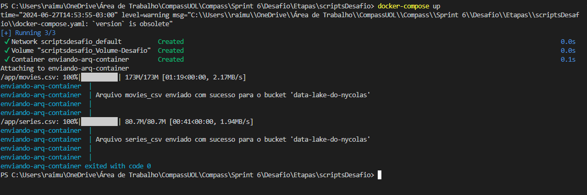
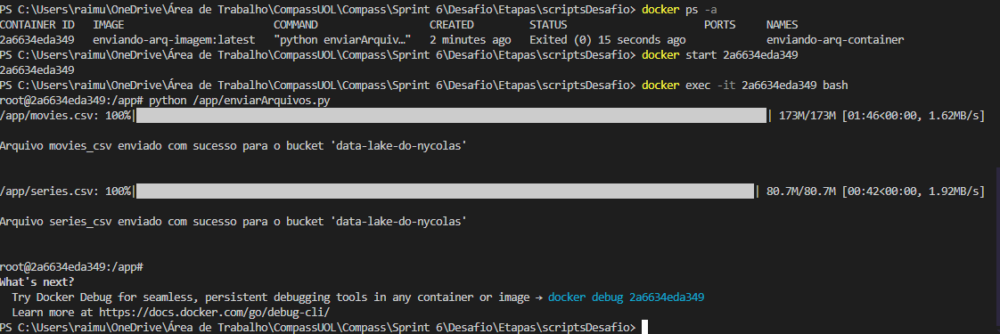
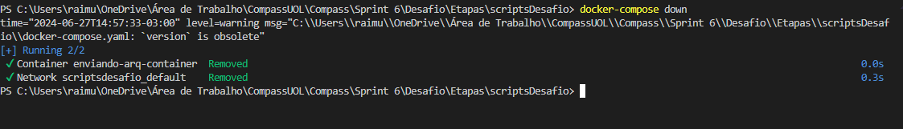

## Informações do desafio:
O objetivo é a práticar a combinação de conhecimentos vistos no Programa, fazer um mix de tudo que já foi dito: ``Enviar dois CSV para um bucket S3.``

## Pergunta para o desafio final:
### "Como a popularidade dos gêneros ação e aventura evoluiu ao longo das décadas, e quais são os diretores mais influentes nesses gêneros ao longo do tempo?"

### Desafio
- [Etapa1](../Desafio/Etapas/scriptsDesafio/)  


## Configuração do ambiente
Vamos configurar o ambiente antes de começar tudo, existem duas opções, você pode instalar as bibliotecas na sua máquina ou passar os nomes delas dentro do arquivo requirements.txt localizado no diretório ``scriptsDesafio/`` e testar dentro de um container docker.

Abra o terminal e instale as bibliotecas necessárias:  
```python
pip install boto3
pip install python-dotenv
pip install tqdm
pip install os
pip install datetime
```

Irei considerar que já entende Docker e vai usar o mesmo ``Dockerfile`` que criei e vai utilizar o código python que fiz. Existem algumas questões importantes para obter o resultado do código com êxito:
- 1 - Crie uma arquivo chamado `.env` e nele coloque as seguintes váriaveis e seus respectivos valores
```
AWS_ACCESS_KEY_ID= <valor da chave aqui>
AWS_SECRET_ACCESS_KEY= <valor da chave aqui>
AWS_SESSION_TOKEN= <valor do token aqui>
``` 
- Coloque suas credênciais nesses campos.
Separar essas credênciais do código fonte é uma boa prática que deve ser adotada, pois nossas credênciais não devem ser vazadas.
- 2 - os arquivos ``movies.csv`` e ``series.csv`` não estarão neste repositório, pelos simples motivo de que são arquivos com mais de 100MB de armazenamento, irei disponibilizar um link para download dos mesmos para que você possa testar na sua máquina: [Baixar](https://drive.google.com/drive/folders/1GBDAWYUUYRXQSl3yTLxHMEmx7q1-ydI-?usp=sharing)

- 3 - Obviamente você deve ter um bucket criado na aws para testar esse codigo, na linha 62 do script você vai localizar a variável ``bucket_name`` é dentro dela que deve colocar o nome do seu bucket. Agora podemos ir paras as etapas do desafio.

## Docker
Só precisamos nos preocupar com a criação da imagem e container docker e também precisamos criar um volume para armazenar os dados persistidos.

- 1 - criar imagem
- 2 - criar um container
- 3 - criar um volume

Para facilitar e fazer tudo isso de uma só vez vou criar um arquivo ``docker-compose.yaml``, então vamos configurar ele assim:  




Depois de concluir isso podemos executar esse arquivo.  

no terminal navegue até o diretório onde está o ``docker-compose.yaml``
```
cd caminho/ate/o/diretorio/ 
```
No seu vai estar diferente por isso coloquei esse exemplo de caminho.
Agora podemos utilizar os seguintes comandos no terminal:
```python
docker-compose build 
```
- Cria a imagem


```python
docker-compose up 
```
- Cria o container e executa o script


```python
docker ps -a
docker start <id>
docker exec -it <container_id> /bin/bash
python /app/enviarArquivos.py
```
- Reutilizando o container 


``` 
docker-compose down
```
- Fechar os containers



