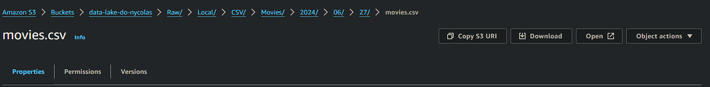
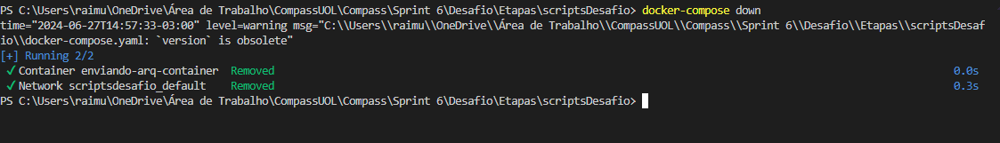

# Aprendizado
#### Nessa Sprint tive a oportunidade de pôr em prática tudo que vim aprendendo nas sprints anteriores, utilizando AWS, Boto3(python) e Docker, consegui enriquecer mais minhas habilidades como engenheiro de dados, criamos um bucket na aws e enviamos dois arquivos lá para dentro, uma tarefa aparentemente simples de se fazer a mão, mas nesse desafio tudo foi feito usando python, desde a criação até o upload, e no final criamos um container docker para rodar esse codigo junto da criação de um volume para armazenar os dados persistidos.

# Desafio
## --[ Ir para Desafio](./Desafio/) --

# Evidências
## --[ Ir para Evidências](./evidencias/) --

# Exercícios
## --[ Ir para Exercícios](./exercicios/) --
## --[ Ir para evidências dos exercícios](./evidencias/exercicios/) --

### Bucket Sprint 6

## Docker
### Dockerfile
 
### DockerCompose
 
### Volume criado

### Criando Imagem e container com dockercompose

### Excluindo container

## --[ Ir para Script Python](./Desafio/Etapas/scriptsDesafio/enviarArquivos.py) --

# Certificados

- Certificado AWS 

- Certificado CloudQuest

