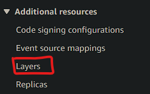
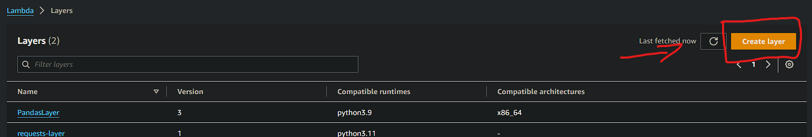
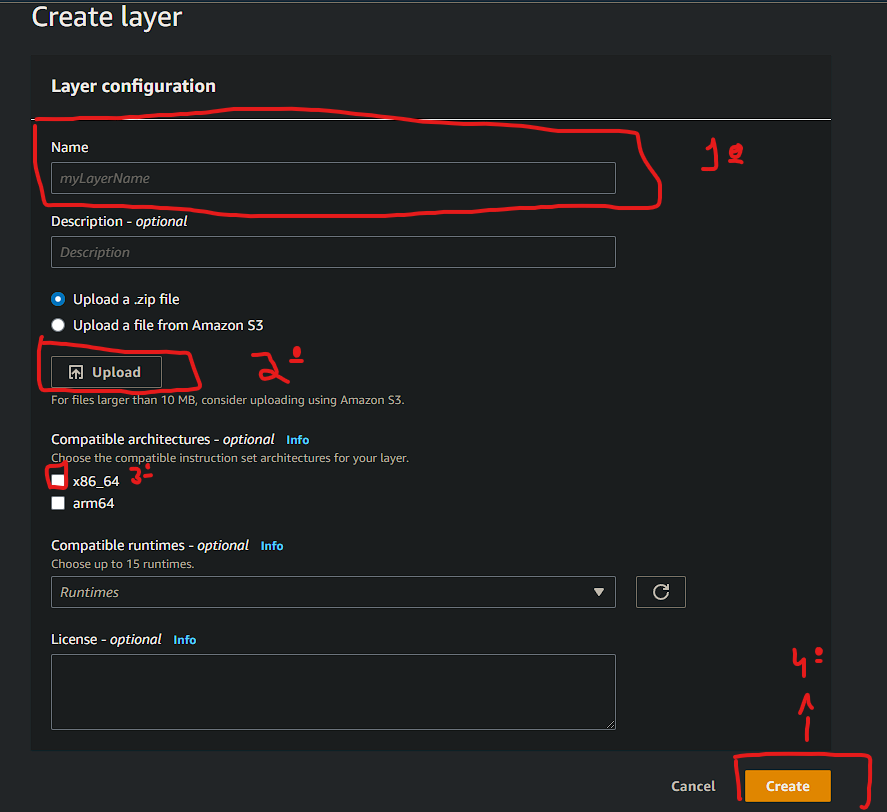
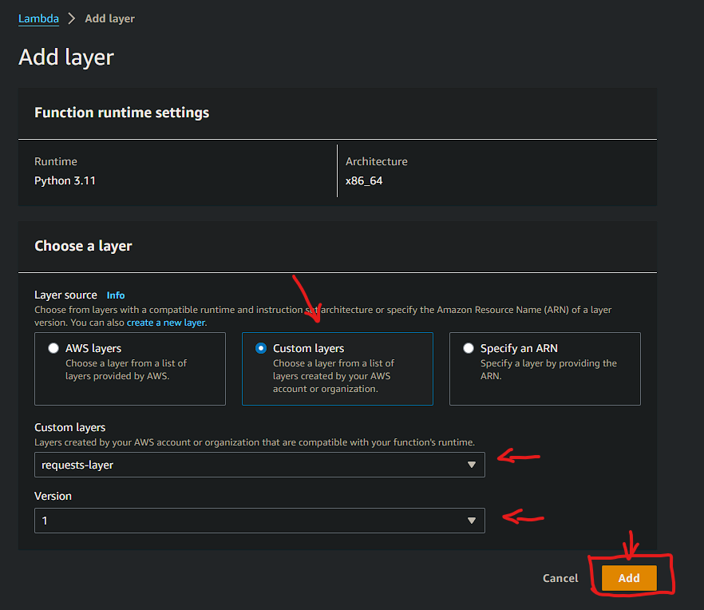
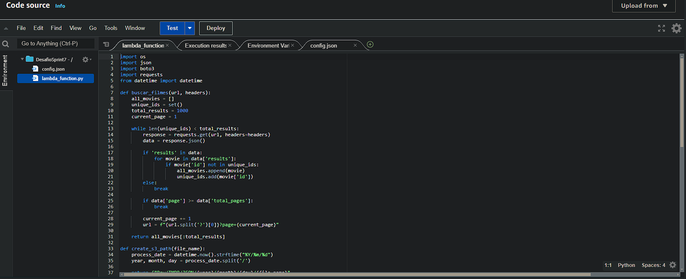
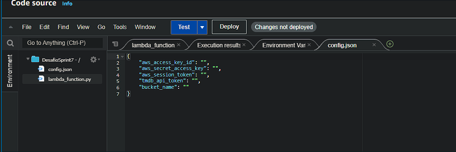
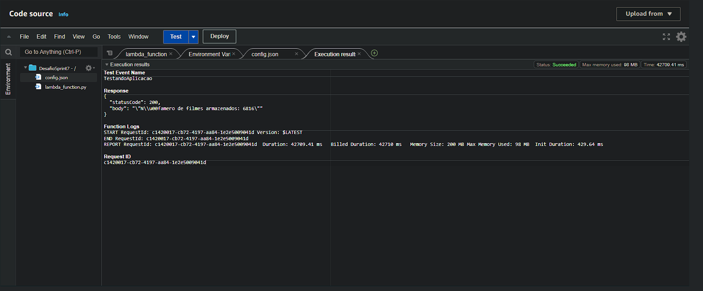
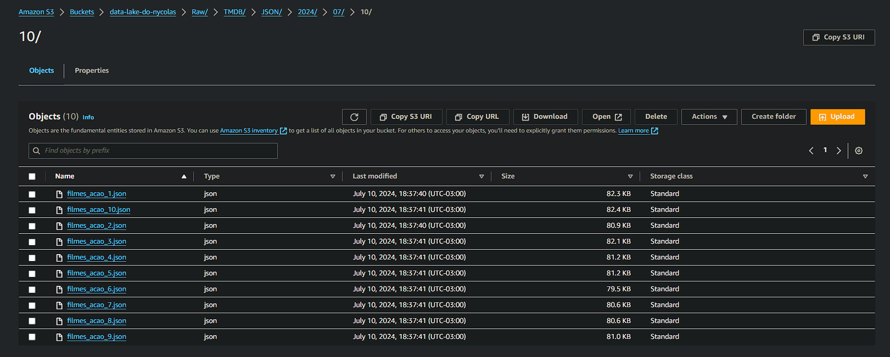

## Informações do desafio:
O Desafio de Filmes e Séries está dividido em 5 entregas. Nesta etapa será realizada a entrega 2. Os detalhes
do Desafio completo estão na Sprint 6:   
``Extrair dados da api do tmdb de acordo com o a pergunta que iremos analisar no desafio final, e fazer tudo isso em uma função lambda.``

## Pergunta para o desafio final
### Pensei bastante e resolvi mudar minha pergunta para:
``"Como a popularidade dos gêneros ação e aventura evoluiu ao longo das décadas?"``

### Desafio
- [Desafio](../Desafio/Etapas/)  


## Configuração do ambiente
Vamos configurar o ambiente antes de começar tudo, existem duas opções, você pode testar o arquivo localmente na sua maquina e também pode criar uma função lambda na AWS para para testar o script:

###  Opção 1: Local  
Abra o terminal e instale as bibliotecas necessárias:  
```shell
pip install requests
pip install boto3
pip install json
pip install os
pip install datetime
pip install pandas
pip install load_dotenv
```

 - Crie um arquivo chamado `.env` e nele coloque as seguintes váriaveis e seus respectivos valores
```
AWS_ACCESS_KEY_ID= <valor da chave aqui>
AWS_SECRET_ACCESS_KEY= <valor da chave aqui>
AWS_SESSION_TOKEN= <valor do token aqui>
TOKEN_API= <valor do token aqui>
BUCKET_NAME_S3= <nome do bucket aqui>
``` 
Coloque suas credênciais nesses campos.
Separar essas credênciais do código fonte é uma boa prática que deve ser adotada, pois nossas credênciais não devem ser vazadas.

- Crie 3 diretórios para armazenar os arquivos ``.json``

terminal
```shell
cd Desafio/Etapas/
mkdir arquivosjson
cd arquivosjson/
mkdir Acao, aventura
```

Para utilizar esse script crie uma conta em https://www.themoviedb.org/settings/api para gerar um token api para conseguir executar o código.


###  Opção 1: Lambda

precisamos criar uma layer da biblioteca requests(Foi a biblioteca que utilizei para efetuar as chamadas de api) para poder utilizar esse script no AWS lambda, para criar vamos fazer os seguintes passos:

terminal
```shell
mkdir python
pip install requests -t python/
Compress-Archive -Path python -DestinationPath python.zip #Windows
zip -r python.zip python/ #Linux
```
Após isso podemos ir para o AWS lambda e criar a layer:  






Depois disso podemos ir para nossa função lambda:  



Como tive problemas com minhas credênciais da aws e as variaveis de ambiente do lambda, tive que criar um um arquivo config.json(funciona como se fosse um ``.env``) e passar minhas credênciais e o token de api dentro dele:



Agora vamor dar run na nossa function


E por fim analisar o nosso bucket no s3




  