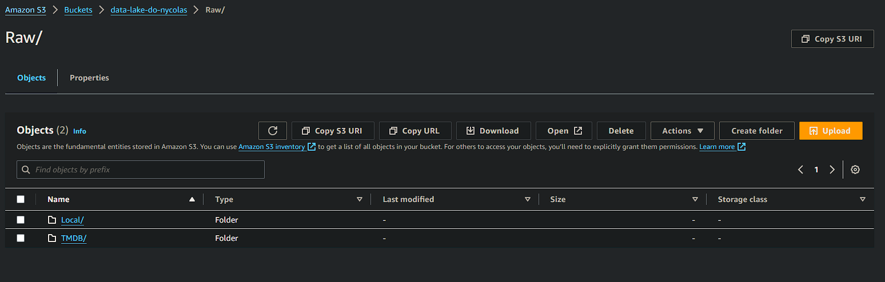
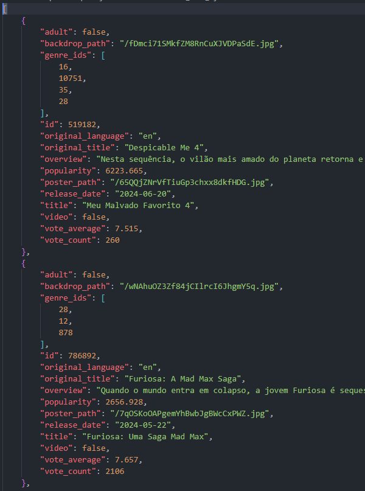
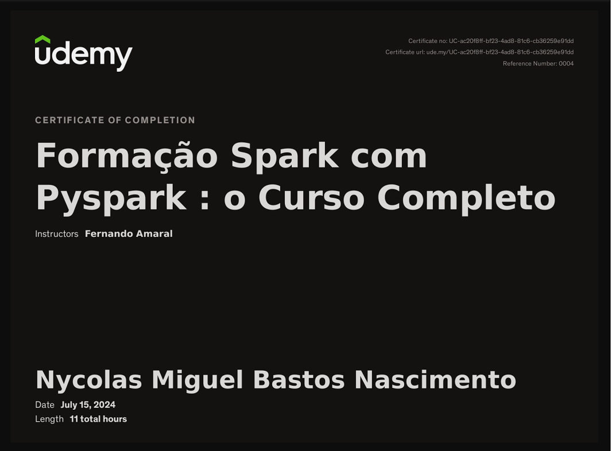

# Aprendizado
#### Nessa Sprint tive a oportunidade de pôr em prática tudo que vim aprendendo nas sprints anteriores, utilizando AWS, Boto3(python) e AWS Lambda e a api do TMDB para extrair dados de filmes.

# Desafio
## --[ Ir para Desafio](./Desafio/) --

# Evidências
## --[ Ir para Evidências](./evidencias/) --

# Exercícios
## --[ Ir para Exercícios](./exercicios/) --
## --[ Ir para evidências dos exercícios](./evidencias/exercicios/) --

### Bucket Sprint 7

### Lambda

### Layer Requests

### Exemplo json

## --[ Ir para Script Python](./Desafio/Etapas/Requisicoes_lambda.py) --

# Certificado Spark

