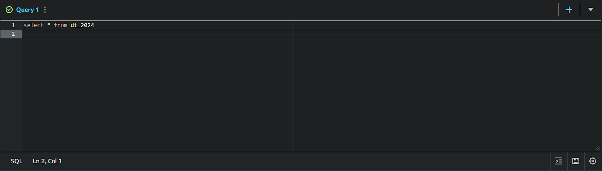

## Informações do desafio:
O Desafio de Filmes e Séries está dividido em 5 entregas. Nesta etapa será realizada a entrega 3. Os detalhes do Desafio completo estão na Sprint 6:   
``
Integrando dados existentes na camada Raw Zone para a Trusted Zone e aplicando transformação("T" do ETL).
``
## Motivadores da API: 
__Apenas segui a API recomendada pelo desafio, não vi necessidade de utilizar outra.__

## Pergunta para o desafio final
``"Como a popularidade dos gêneros ação e aventura evoluiu ao longo das décadas?"``

### Desafio
- [Desafio](../Desafio/Etapas/)  

Faremos uso do Apache Spark, através do serviço AWS Glue, integrando dados existentes na camada Raw Zone:

 para a Trusted Zone: 
 - Todos os dados da Trusted Zone possuem o mesmo formato de armazenamento.
 - Todos os dados serão persistidos na Trusted no formato PARQUET.
 - particionados por data de criação do tweet ou data de coleta do TMDB ``dt=<ano\mês\dia>``

### Uma explicação breve do que são os arquivos `.PARQUET`:
O Apache Parquet é um formato de arquivo em coluna com otimizações para acelerar as consultas. É um formato de arquivo mais eficiente do que CSV ou JSON ([fonte](https://learn.microsoft.com/pt-br/azure/databricks/query/formats/parquet)).

## JOBS
Vamos começar criando os jobsGlue dos arquivos CSV e JSON.

Passo a passo para criar um job:
- 1 - *Dentro da AWS pesquise pelo serviço do AWS GLUE*
- 2 - *Dentro dele, click em `ETL JOBS`*
- 3 - *click em `Script Editor`*
- 4 - *Em `Engine` selecione `Spark`, em `options` selecione `start fresh` e po fim click em `Create Script`*

Temos algumas opções para configurar após criar:   
## Script | Job details | Runs | Data quality | Schedules | Version Control

Dentre essas opções só vamos utilizar 3 delas:

## `Script` | `Job details` | `Runs` 

Em `Script` vamos colocar todo o nosso código que será executado pelo job.

Agora em `Job details` vamos fazer algumas configurações importantes para realizar este desafio:
- 1 - *Worker type: Informe G 1x (opção de menor configuração).*
- 2 - *Requested number of workers: Informe 2, que é a quantidade mínima.*
- 3 - *Job timeout (minutes): Mantenha em 60 ou menos, se possível. As demais opções deixe padrão como estão.*
- 4 - *`Opcional:` em `advanced properties` procure por `Job parameters` criei dois parâmetros com os caminhos do meu bucket, para evitar deixar o caminho do meu bucket exposto no código.*

 Essas são as configurações necessárias para executar corretamente os scripts, pode testar você mesmo, eles estão disponíveis -> [aqui](../Desafio/Etapas/).

 Por fim, podemos clicar em `Run` e depois checar se está tudo certo, na opção `Runs`.
 

## Resultado da execução

Com isso eu poderia finalizar o desafio tranquilamente, mas vamos criar um `Crawler` para criar um database do Glue Data Catalog e acessível via AWS Athena compreendendo a Trusted Zone do data lake. 

Depois de criar o crawler inicie ele, quando finalizar busque pelo serviço do AWS Athena, nele podemos vizualizar a criação da tabela com os nossos dados devidamente criado dentro dele.

Podemos dar um Select para vizualizar os dados:

