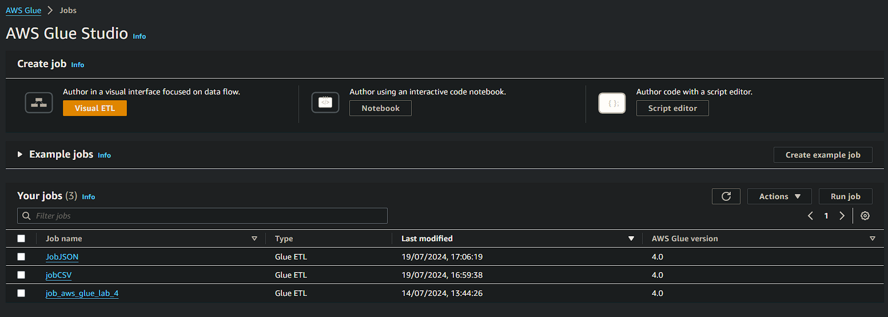
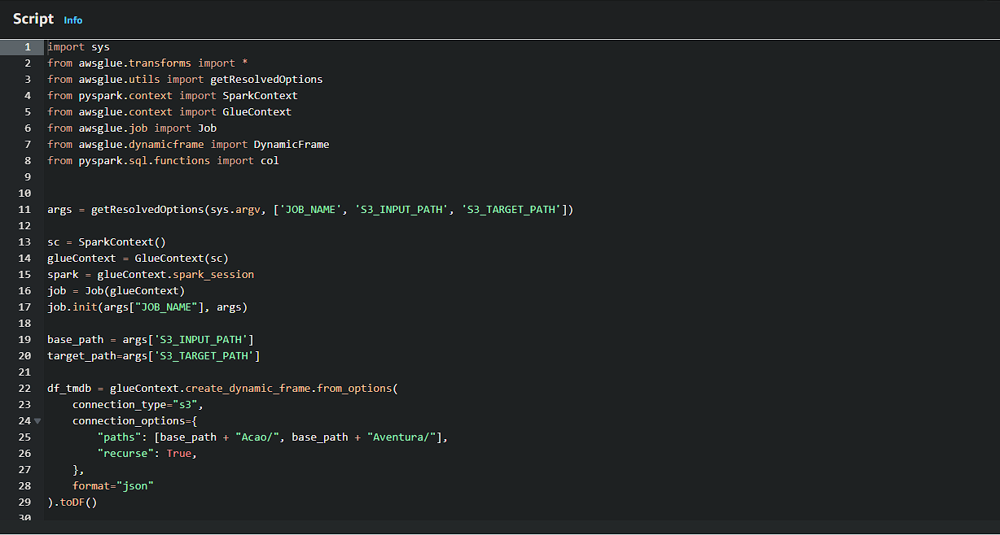
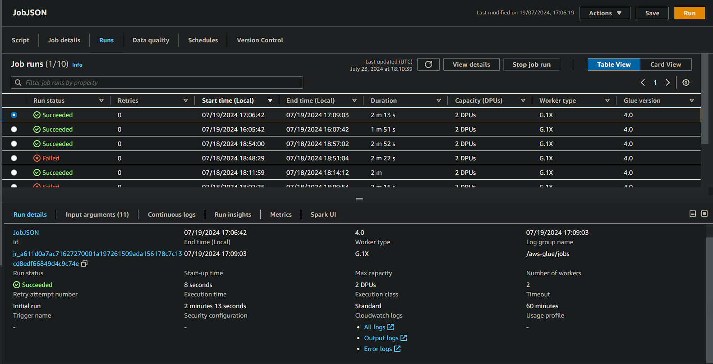
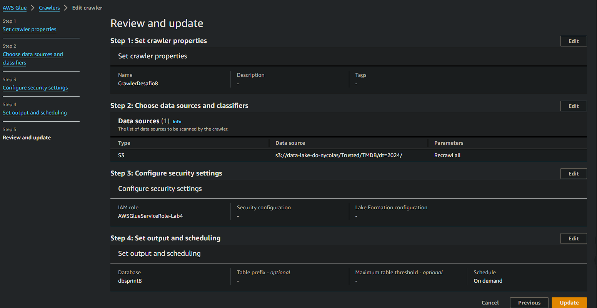
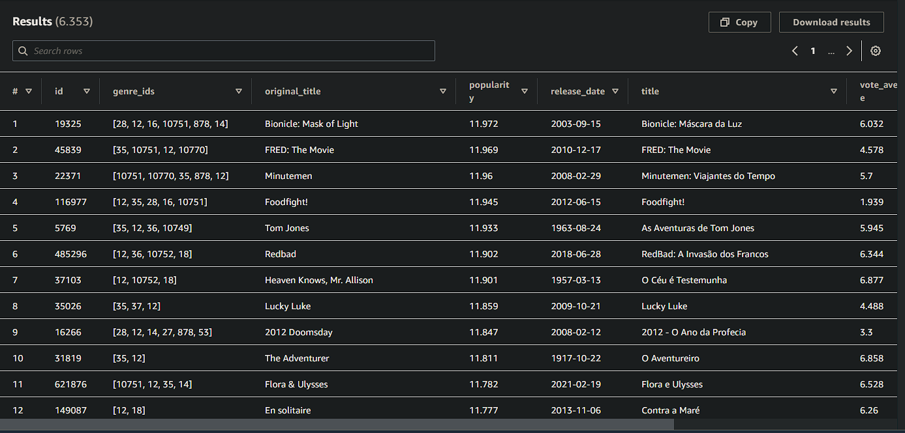

# Aprendizado
#### Nessa Sprint tive a oportunidade de pôr em prática tudo que vim aprendendo nas sprints anteriores, utilizando AWS Glue, AWS Lake Formation, AWS Athena e Spark fiz o processo de Transformação(do ETL) para transformar meus dados extraidos na sprint passada.

# Desafio
## --[ Ir para Desafio](./Desafio/) --

# Evidências
## --[ Ir para Evidências](./evidencias/) --

# Exercícios
## --[ Ir para Exercícios](./exercicios/) --
## --[ Ir para evidências dos exercícios](./evidencias/exercicios/) --

### Bucket Sprint 8

### Glue

### Crawler

### Athena

## --[ Ir para Script Python](./Desafio/Etapas/) --

