## Informações do desafio:
O Desafio de Filmes e Séries está dividido em 5 entregas. Nesta etapa será realizada a entrega 4. Os detalhes do Desafio completo estão na Sprint 6:   
``
Integrando dados existentes na camada Trusted para a Refined.
``

## Perguntas para o desafio final
### Obs: tive que mais uma vez, trocar as perguntas, pois acabei tendo imprevistos ao decorrer das sprints com algumas informações que não estavam corretas.
``"1. Média de Popularidade dos Gêneros "Ação" e "Aventura" ao Longo das Décadas"``  
``"2. Mudança da Popularidade dos Filmes de Ação e Aventura ao Longo do Tempo"``  
``"3. Filme de Ação e Aventura com a Maior Média de Votos em Cada Década"``  
``"4. Filmes de ação e aventura com a Maior Contagem de Votos"``   
``"5. Gênero associado frequentemente em filmes de sucesso de Ação e Aventura"``  
### Desafio
- [Desafio](../Desafio/Etapas/)  

Faremos uso do Apache Spark, através do serviço AWS Glue, integrando dados existentes na camada Trusted, refinando e enviando para a camada Refined.

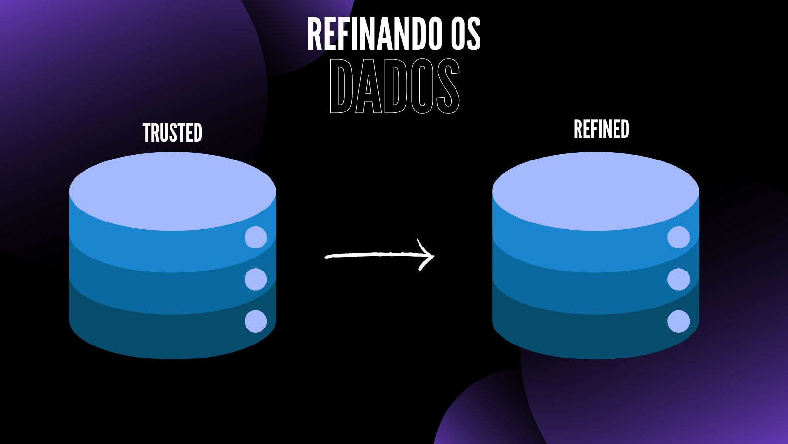

 Refined zone: 
 - os dados são enriquecidos não somente pelos dados da base original, mas podendo inclusive agregar dados de outras bases a depender do seu uso.
 - Formato relacional, podendo inclusive se apresentar em um modelo dimensional.     

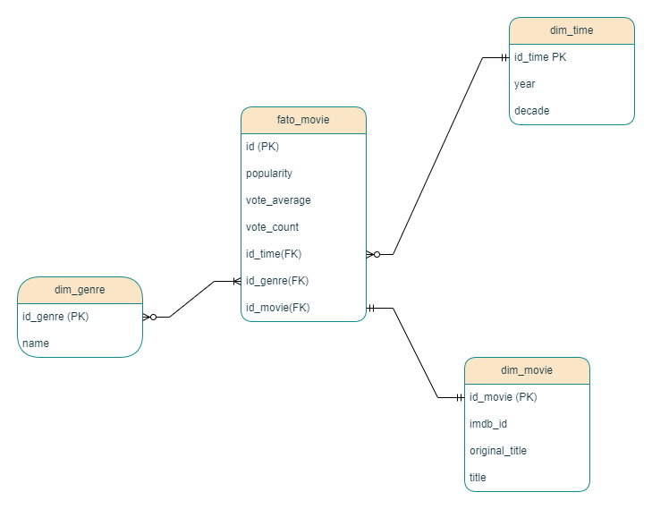

## JOB
Vamos começar criando o jobGlue para poder começar a criar o código.
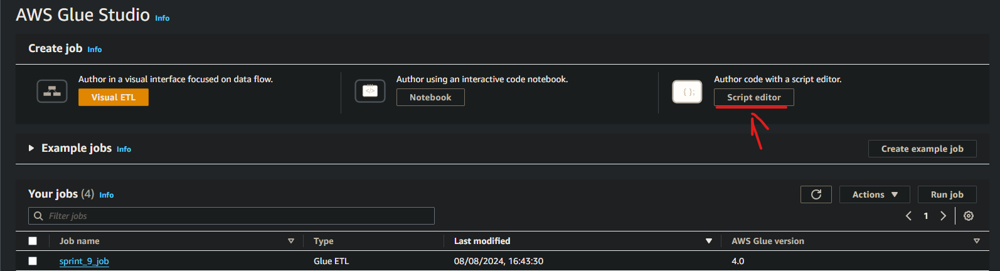

Passo a passo para criar um job:
- 1 - *Dentro da AWS pesquise pelo serviço do AWS GLUE*
- 2 - *Dentro dele, click em `ETL JOBS`*
- 3 - *click em `Script Editor`*
- 4 - *Em `Engine` selecione `Spark`, em `options` selecione `start fresh` e por fim click em `Create Script`*

Temos algumas opções para configurar após criar:   
## Script | Job details | Runs | Data quality | Schedules | Version Control

Dentre essas opções só vamos utilizar 3 delas:

## `Script` | `Job details` | `Runs` 

Em `Script` vamos colocar todo o nosso código que será executado pelo job.

Agora em `Job details` vamos fazer algumas configurações importantes para realizar este desafio:
- 1 - *Worker type: Informe G 1x (opção de menor configuração).*
- 2 - *Requested number of workers: Informe 2, que é a quantidade mínima.*
- 3 - *Job timeout (minutes): Mantenha em 60 ou menos, se possível. As demais opções deixe padrão como estão.*

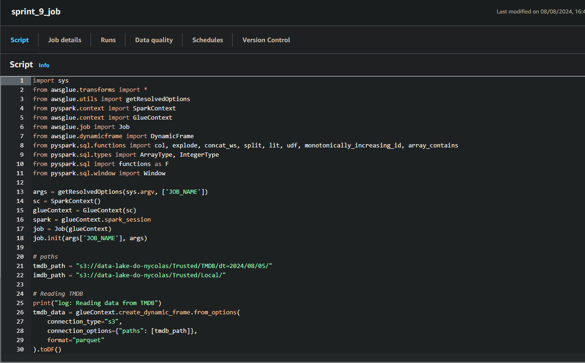

 Essas são as configurações necessárias para executar corretamente os scripts, pode testar você mesmo, eles estão disponíveis -> [aqui](../Desafio/Etapas/).

 Por fim, podemos clicar em `Run` e depois checar se está tudo certo, na opção `Runs`.
 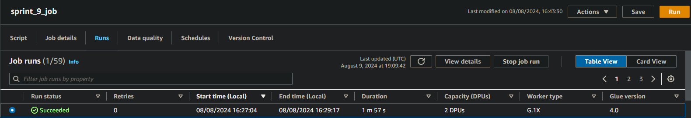

## Resultado da execução
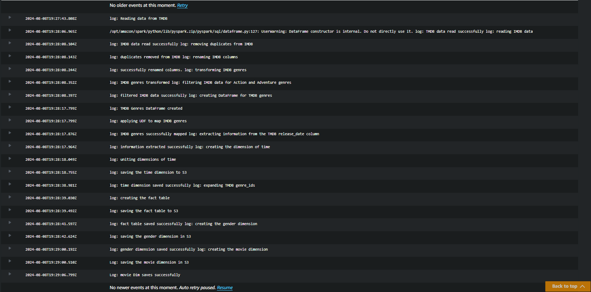
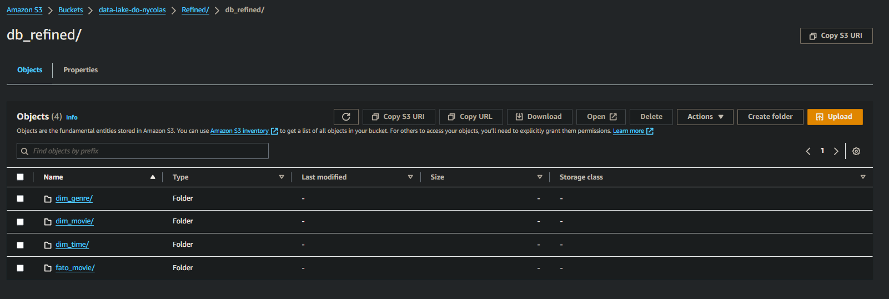

Com isso eu poderia finalizar o desafio tranquilamente, mas vamos criar um `Crawler` para criar as tabelas do Glue Data Catalog e acessível via AWS Athena, para vizualizarmos se está tudo certo com os dados. 

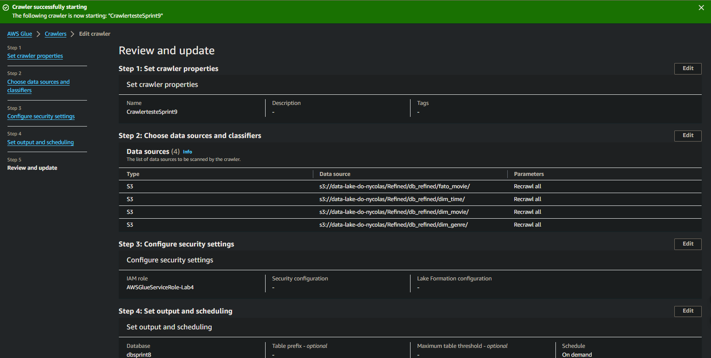

Depois de criar o crawler inicie ele, quando finalizar busque pelo serviço do AWS Athena, nele podemos vizualizar a criação da tabela com os nossos dados devidamente criado dentro dele.

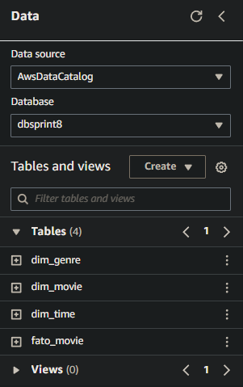

Podemos dar um Select para vizualizar os dados:  

### Query: Média de Popularidade dos Gêneros "Ação" e "Aventura" ao Longo das Décadas
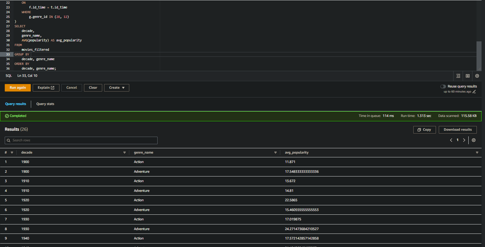
### Query: Gêneros Associados aos Filmes Mais Populares de Ação e Aventura
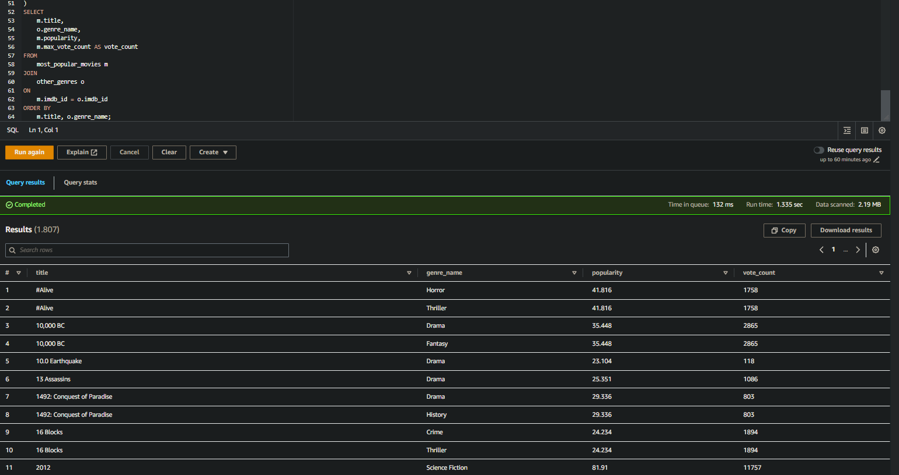