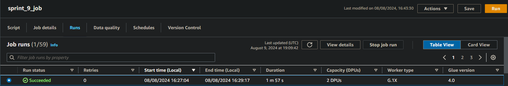
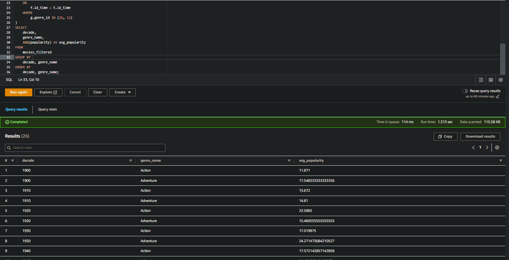
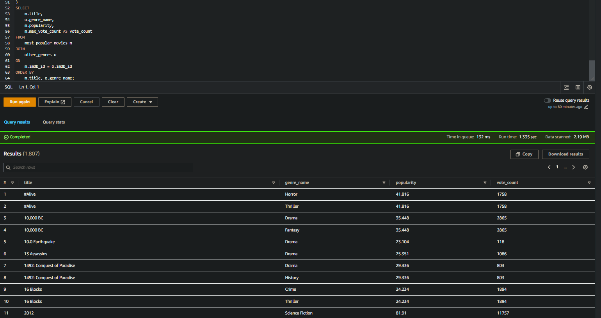

# Aprendizado
#### Nessa Sprint tive a oportunidade de pôr em prática tudo que vim aprendendo nas sprints anteriores, utilizando AWS Glue, AWS Lake Formation, AWS Athena e Spark fiz o processo de Load(do ETL) para enviar meus dados e refinalos para ficarem utilizáveis no desafio final.

# Desafio
## --[ Ir para Desafio](./Desafio/) --

# Evidências
## --[ Ir para Evidências](./evidencias/) --

# Exercícios
## -- Sprint sem exercícios --

# Correção das Sprints anteriores
## -- [ Ir para modificações](./modificacoes_Sprints_passadas/) --
### Bucket Sprint 9

### Glue

### Crawler

### Athena

## --[ Ir para Script Python](./Desafio/Etapas/) --

