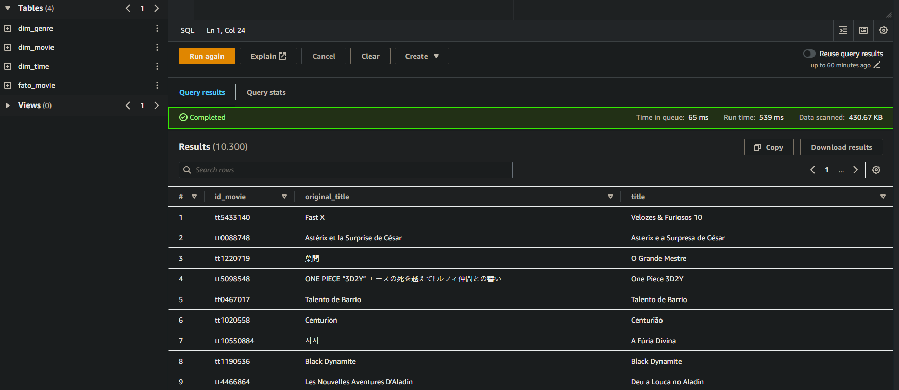
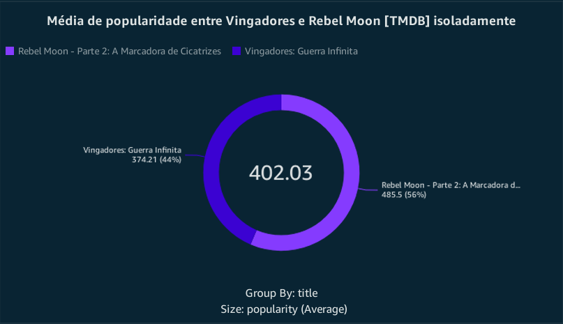

# Aprendizado
#### Nessa Sprint tive a oportunidade de pôr em prática o consumo dos dados que haviamos transformado e refinado em sprints anteriores utilizando amazon Quicksight.

# Desafio
## --[ Ir para Desafio](./Desafio/) --

# Evidências
## --[ Ir para Evidências](./evidencias/) --

# Exercícios
## -- Sprint sem exercícios --

### Athena sprint 10

### Base de dados

### gráficos
## - gráfico 1

## - gráfico 2

## - gráfico 3

## - gráfico 4

## --[ Ir para o Dashboard](./Desafio/Etapas/dashboardDesafioFinal.pdf) --

